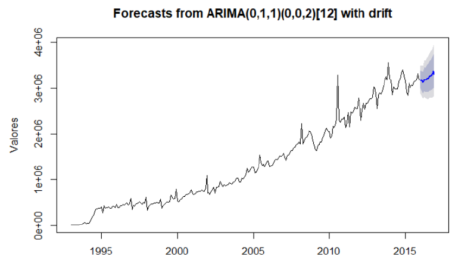

# ICMS collection forecast for the state of Minas Gerais - Brazil.
Study developed to analyze time series and forecast ICMS tax collection for the State of Minas Gerais - Brazil.

## Table of Contents
* [General information](#general-information)
* [Technologies Used](#technologies-used)
* [Forecast](#Forecast)
* [Setup](#setup)
* [Project Status](#project-status)
* [Room for Improvement](#room-for-improvement)
* [Acknowledgements](#acknowledgements)
* [Contact](#contact)
<!-- * [License](#license) -->

## General Information
- Work developed within the scope of the discipline of Time Series and Forecasts, of the master's course in Data Science of the Faculty of Sciences - University of Porto - Portugal.
- The work makes an exploratory analysis of the data, stationarity analysis, tests with models and revenue forecasts for the 12 months of the year 2016.
- ARIMA models and Artificial Neural Networks are analyzed.
- ARIMA models obtained the best results

## Technologies Used
- The work was developed in R programming language.

## Forecast
* Forecast for the year 2016.

## Setup
* To run the program related to forecasts, just have the environment software R installed.

## Project Status
* The work was developed only for the discipline mentioned above, and thus is closed.

## Room for Improvement
Include areas you believe need improvement / could be improved. Also add TODOs for future development.

Room for improvement:
- Testing with other statistical and machine learning models would be interesting.

## Acknowledgements
* [FCUP](https://sigarra.up.pt/fcup/pt/web_page.inicial).

## Contact
Rodrigo Salles. Email: engenharia.salles@gmail.com 

...feel free to contact me!

<!-- Optional -->
<!-- ## License -->
<!-- This project is open source and available under the [... License](). -->

<!-- You don't have to include all sections - just the one's relevant to your project -->
